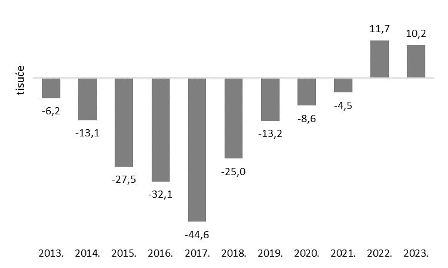
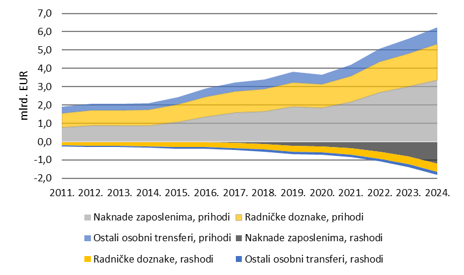

Na dan 1. siječnja 2024., Hrvatska je po prvi put nakon više od deset godina zabilježila blagi porast broja stanovnika. 
Ovaj preokret uslijedio je nakon dugotrajnog razdoblja depopulacije i rezultat je pozitivne neto migracije u 2022. i 2023. godini (Slike 1 i 2). Ipak, iza tog blagog demografskog rasta ne stoji prirodni prirast niti val povratka iseljenika, već znatno veći priljev stranih radnika, što odražava strukturne promjene u migracijskim obrascima i domaćem tržištu rada. 

U tom kontekstu, Hrvatska se sve jasnije pozicionira kao periferno gospodarstvo unutar europskog tržišta rada: iz nje odlazi kvalificirana radna snaga prema razvijenijim članicama EU, dok se istovremeno uvozi radna snaga niže kvalifikacije iz trećih zemalja. Termin perifernog gospodarstva koristi se za zemlje koje su integrirane u šire ekonomske sustave, ali u ulogama koje ih čine ovisnima o vanjskim izvorima rasta, poput stranih ulaganja, turističke potrošnje ili osobnih doznaka. U takvim gospodarstvima često dolazi do usporednog izvoza radne snage i znanja te uvoza osnovne radne snage, pri čemu je tehnološka samodostatnost niska, a utjecaj na kreiranje šireg gospodarskog i regulatornog okvira vrlo slaba.

Takva struktura radnih migracija, u kojoj Hrvatska simultano izvozi i uvozi radnu snagu, ima neposredne učinke na dinamiku plaća i tržište rada u zemlji. Priljev jeftine strane radne snage ublažava pritisak na rast plaća u privatnom sektoru, dok javni sektor bilježi dvoznamenkasti rast plaća koji nije popraćen odgovarajućim rastom produktivnosti. Time se stvara neusklađenost između strukture troškova rada i stvarne učinkovitosti, što doprinosi trajno povišenim inflatornim pritiscima (HNB, Komentar o kretanju inflacije u prosincu 2024. i Kako porast plaća utječe na inflaciju).

  
*Slika 1. Broj stanovnika u Hrvatskoj tijekom godina. Izvor: izrada autorice prema podacima Eurostata*

  
*Slika 2. Neto migracije u Hrvatskoj. Izvor: izrada autorice prema podacima Svjetske banke*

Platna bilanca  
Migracije ne oblikuju samo tržište rada, već stvaraju i međunarodne financijske tokove kada iseljenici šalju novac svojim obiteljima i kontaktima u zemlji porijekla. Ovi novčani tokovi, poznati kao osobne doznake, prema metodologiji šestog izdanja Priručnika o platnoj bilanci i međunarodnoj investicijskoj poziciji (BPM6), obuhvaćaju dvije kategorije:

– naknade zaposlenima – evidentirane na računu primarnog dohotka, te  
– osobne transfere, koji uključuju radničke doznake i ostale osobne transfere, evidentirane na računu sekundarnog dohotka (vidi Sliku u naslovu).

I dok s jedne strane bilježimo porast broja doseljenih stranih radnika, doznake iz inozemstva od naših iseljenika i dalje snažno rastu – i u nominalnom iznosu i u relativnom udjelu u BDP-u. Prema posljednjim dostupnim podacima Hrvatske narodne banke, u 2024. godini ukupni prihodi od osobnih doznaka iznosili su 6,3 milijarde eura, dok su rashodi prema inozemstvu iznosili 1,9 milijardi eura (Slika 3). Neto osobne doznake (razlika između prihoda iz inozemstva i rashoda prema inozemstvu) iznosile su 4,4 milijarde eura ili 5,2 % BDP-a (Slika 4). Važno je pritom naglasiti da je nešto niži udio u BDP-u u odnosu na prethodne godine posljedica snažnog nominalnog rasta BDP-a, a ne smanjenja neto doznaka.

  
*Slika 3. Priljevi i odljevi osobnih doznaka: kretanja i struktura. Izvor: izrada autorice prema podacima Hrvatske narodne banke*

  
*Slika 4. Osobne doznake, neto: kretanja i struktura. Izvor: izrada autorice prema podacima Hrvatske narodne banke i Eurostata*

Iako se radi o formalno privatnim transferima, njihov kumulativni iznos ima jasan makroekonomski učinak, osobito u zemljama s dugotrajnim iseljavanjem i strukturnom ovisnošću o vanjskim prihodima. Njihova makroekonomska važnost vidljiva je iz činjenice da bi saldo tekućeg računa u većini promatranih godina bio negativan kada bi se isključili osobni transferi iz inozemstva (Slika 5). To dodatno potvrđuje ulogu doznaka kao ključnog stabilizacijskog mehanizma platne bilance i vanjskih priljeva u uvjetima strukturnog deficita.

  
*Slika 5. Tekući račun platne bilance i osobne doznake. Izvor: izrada autorice prema podacima HNB-a*

Digitalizacija i fiskalna integracija osobnih doznaka  
Usporedno s rastom neto osobnih doznaka, mijenja se i način na koji se one šalju. Na svjetskoj razini sve veći udio otpada na digitalne kanale – mobilne aplikacije, fintech servise i internetske platforme – dok tradicionalni kanali poput banaka i mjenjačnica postupno gube tržišni udio. 

Iako za Hrvatsku trenutno ne postoje javno dostupni podaci koji bi precizno prikazali strukturu kanala prijenosa, može se pretpostaviti da domaći obrasci djelomično prate globalne trendove. Digitalni transferi posebno su zastupljeni među mlađim migrantima te osobama koje žive u udaljenijim regijama, gdje je pristup fizičkim financijskim institucijama ograničen.

Ova promjena ima šire učinke. Digitalni kanali omogućuju brže, jeftinije i transparentnije slanje sredstava, a istovremeno pridonose većoj financijskoj uključenosti – jer omogućuju primateljima bez klasičnog bankovnog računa jednostavan ulazak u formalni financijski sustav. Time se otvara prostor za fiskalnu integraciju doznaka, odnosno za njihovo uključivanje u razvojne i financijske politike kroz nenametljive, poticajne instrumente.

Primjeri takvih politika uključuju:

– porezne poticaje za korištenje formalnih i digitalnih kanala (npr. snižene naknade ili fiskalne olakšice),  
– izdavanje dijasporskih obveznica za financiranje infrastrukturnih i obrazovnih projekata,  
– sufinanciranje lokalnih inicijativa u suradnji s dijasporom,  
– te financijsku edukaciju i alate za štednju i ulaganje, uključujući poticanje poduzetništva i samozapošljavanja.

U širem kontekstu, osobne doznake postaju više od pokazatelja migracijskih kretanja – one predstavljaju i potencijalni instrument za socioekonomski razvoj, otpornost kućanstava i stabilnost lokalnih zajednica, osobito u demografski ranjivim regijama.

